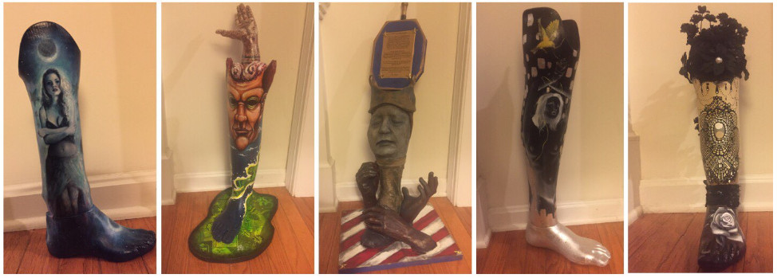

# Painted-Prosthetics

## Our mission
Life can be unfair and we, the more fortunate people, aim to make it slightly more just.

### The problem
The **cheapest prosthetic of a leg costs 5000$**, some being as expensive as a house! Our goal is to raise awareness that a lot of people cannot afford a so needed prosthethic! We aim to get together an amputee, an artist and a company, so that they help each other out.

### What do we do to help?
#### Amputee
*“If life gives you lemons, you make lemonade.”― Elbert Hubbard*  
By no means, loosing a limb is nothing to be happyt about. However, we can make it less bad. Have you ever wanted a beautiful, painted leg that is one of a kind in the entire world? Let your imagination free and don't be affraid to show yourself. By matching an amputee with an artist we will allow them to make a request and ask for any kind of art they want on their prosthetics. Matching a company, we will donate at least a socket, or a whole leg!  

Are you maybe someone who just baught a new prosthetic and now you have a spare, unused one? Unused prosthetics are gold for us, because we make art out of them and later auction as a means of raising awareness and gathering donation funds. Have unused prosthetic, don't it anymore- please donate it to us :) !

#### Artist
*“The principles of true art is not to portray, but to evoke”― Jerzy Kosinski*  
Probably the best way to express yourself, by both helping someone, feeling their pain and telling their story through an item they truly need. Showcase your art and become more known. Help an amputee by raising money by drawing on old, unused prosthetics which will be auctioned for raising money in order to buy either just a socket or a whole prosthetic. Paint on new prosthetic, helping amputee to better epxress their personality and make them happy!

#### Company
*“Carve your name on hearts, not tombstones. A legacy is etched into the minds of others and the stories they share about you.”― Shannon Alder*  
Similar to an artist, a company can get its' name known through donating new prosthetics or sockets. We will put your name up on our website as one of the supporters and appreciate it as much as we can. In the end, it's not fame or money that matters, but a feeling knowing that life is a better place because of You.
#### You!
*“Every sunrise is an invitation for us to arise and brighten someone's day.”― Richelle E. Goodrich*  
Prosthetics are extremely expensive and every kind of help matters. If you are someone who has a few dollars to spare- a donation would be much appreciated. Don't have any money? That's also no problem, but please, don't be silent and tell your friends and relatives about the hardships of getting a prosthetic. In fact, reading this and not forgetting us for a few days is enough, so thank you already :) !

## Are you a developer and want to contribute?
We need every kind of help we can get! The below is a link of how to get started with the project either as a backend or frontend developer. A detailed description of what you need to do in order to join can be found in the link below:  
[Link to beginners guide]([TODO])

Would you like to know more about what are we making and why? Check out our wiki page:  
[Painted Prosthetics Wiki](https://github.com/csinn/Painted-Prosthetics/wiki)
